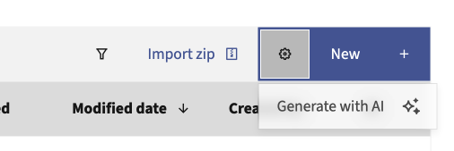
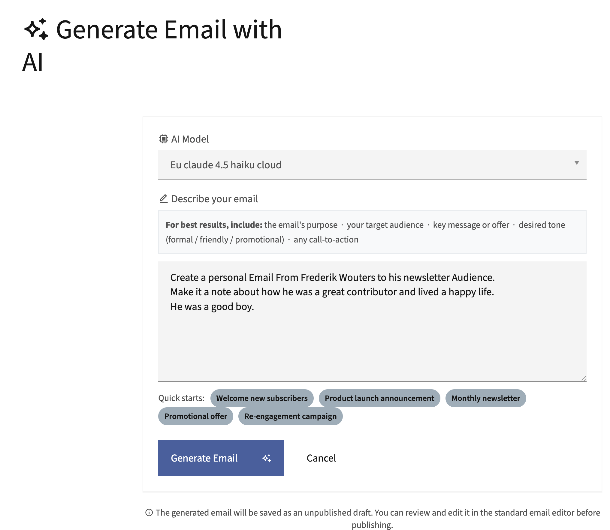
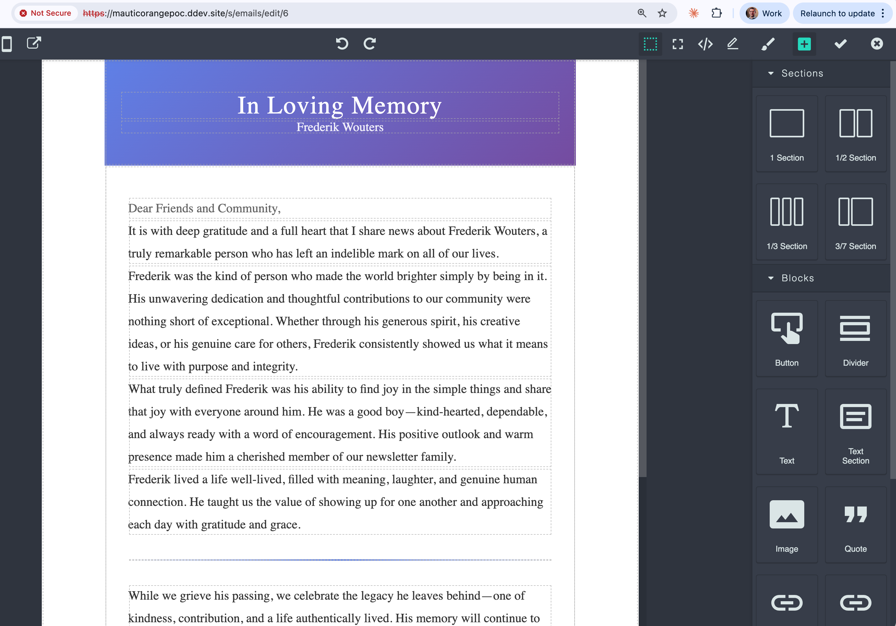

# MauticAIEmailGeneratorBundle

A Mautic plugin that generates complete HTML email drafts from a plain-text description using any AI model configured through [MauticAIconnectionBundle](https://github.com/dropsolid).

Built by [Frederik Wouters](https://frederikwouters.be/) at [Dropsolid](http://dropsolid.com/).

---

## What it does

The plugin adds a **Generate with AI** entry to the email list's "New" dropdown. Clicking it opens a form where you describe the email you want. On submit, the plugin calls the configured LiteLLM-compatible model, generates a fully inline-styled HTML email, and saves it as an unpublished draft. Mautic then redirects you directly to the standard email editor so you can review and publish it.

---

## Screenshots

### 1. Entry point in the email list

### 2. Generation form

### 3. Generated draft in the Mautic email editor

---

## Requirements

- Mautic 5.x
- [MauticAIconnectionBundle](https://github.com/dropsolid) installed and configured with at least one LiteLLM-compatible model
- PHP 8.1+

---

## Installation

1. Place the bundle in `<mautic-root>/plugins/MauticAIEmailGeneratorBundle`.
2. Clear the Mautic cache: `bin/console cache:clear`.
3. Run the plugin install command: `bin/console mautic:plugins:reload`.
4. Enable the plugin under **Settings > Plugins > AI Email Generator**.

---

## Usage

1. Go to **Emails** in the Mautic menu.
2. Click the **New** dropdown and select **Generate with AI**.
3. Pick an AI model from the dropdown (populated from MauticAIconnectionBundle).
4. Enter a description of the email. The more context you provide (purpose, audience, tone, call-to-action), the better the output.
5. Use one of the quick-start buttons to pre-fill a common scenario.
6. Click **Generate Email**. The plugin saves an unpublished draft and opens it in the email editor.

---

## How it works

| Component | Description |
|---|---|
| `ButtonSubscriber` | Injects the "Generate with AI" button into the email list toolbar via Mautic's button event system |
| `GeneratorController` | Handles the generation form and POST request |
| `EmailGeneratorService` | Calls `LiteLLMService`, parses the HTML response, extracts the subject from the `<title>` tag, and persists an unpublished `Email` entity |
| `AiEmailGeneratorIntegration` | Registers the plugin with Mautic's integration framework (no credentials required) |

The service sends a strict system prompt instructing the model to return only raw HTML with inline CSS, a 600 px centered layout, and no placeholder text.

---

## License

MIT

---

## Credits

Developed by [Frederik Wouters](https://frederikwouters.be/) at [Dropsolid](http://dropsolid.com/).
